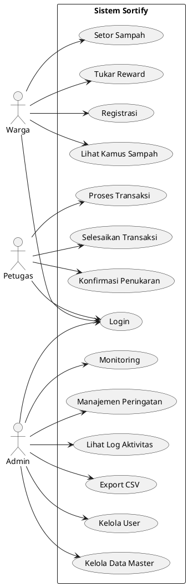

# BAB III: ANALISIS

## 3.1 Analisis Kebutuhan Fungsional

### 3.1.1 Kebutuhan Fungsional Warga

| Kode | Kebutuhan | Deskripsi |
|------|-----------|-----------|
| F-W-01 | Registrasi Akun | Warga dapat mendaftarkan akun baru. |
| F-W-02 | Login | Warga dapat login ke sistem. |
| F-W-03 | Lihat Dashboard | Warga dapat melihat profil, poin, histori transaksi, dan notifikasi. |
| F-W-04 | Lapor Setor Sampah | Warga dapat mengajukan setoran sampah dengan detail kategori, berat estimasi, dan foto. |
| F-W-05 | Lihat Kamus Sampah | Warga dapat melihat database jenis sampah dan cara penanganannya. |
| F-W-06 | Tukar Reward | Warga dapat menukarkan poin dengan reward yang tersedia. |
| F-W-07 | Download Struk | Warga dapat mengunduh struk transaksi dalam format PDF. |
| F-W-08 | Batalkan Transaksi | Warga dapat membatalkan transaksi yang masih pending. |
| F-W-09 | Ubah Password | Warga dapat mengubah password akun. |
| F-W-10 | Upload Foto Profil | Warga dapat mengunggah foto profil. |
| F-W-11 | Lihat Leaderboard | Warga dapat melihat peringkat berdasarkan total poin. |

### 3.1.2 Kebutuhan Fungsional Petugas

| Kode | Kebutuhan | Deskripsi |
|------|-----------|-----------|
| F-P-01 | Login | Petugas dapat login ke sistem. |
| F-P-02 | Dashboard Petugas | Petugas melihat daftar transaksi pending, penukaran reward, dan notifikasi. |
| F-P-03 | Proses Transaksi | Petugas mengubah status transaksi dari PENDING ke DIPROSES. |
| F-P-04 | Selesaikan Transaksi | Petugas menimbang sampah (input berat final) dan upload foto bukti. |
| F-P-05 | Tolak Transaksi | Petugas menolak transaksi dengan alasan. |
| F-P-06 | Konfirmasi Penukaran | Petugas memverifikasi penukaran reward dengan kode AMDAL. |
| F-P-07 | Batalkan Penukaran | Petugas membatalkan penukaran (refund poin + stock). |
| F-P-08 | Kelola Reward | Petugas CRUD item reward. |
| F-P-09 | Beri Peringatan | Petugas memberi warning ke warga. |

### 3.1.3 Kebutuhan Fungsional Admin

| Kode | Kebutuhan | Deskripsi |
|------|-----------|-----------|
| F-A-01 | Login | Admin dapat login ke sistem. |
| F-A-02 | Dashboard Admin | Admin melihat chart dan statistik aplikasi. |
| F-A-03 | Kelola Warga | Admin CRUD data warga. |
| F-A-04 | Kelola Staff | Admin CRUD data staff beserta akunnya. |
| F-A-05 | Kelola Kategori Sampah | Admin CRUD kategori sampah. |
| F-A-06 | Kelola Item Sampah | Admin CRUD item sampah. |
| F-A-07 | Kelola Drop Point | Admin CRUD lokasi drop point. |
| F-A-08 | Kelola Reward | Admin CRUD item reward. |
| F-A-09 | Kelola Pengumuman | Admin CRUD pengumuman. |
| F-A-10 | Kelola Transaksi | Admin CRUD transaksi. |
| F-A-11 | Monitoring Reward | Admin memantau penukaran reward. |
| F-A-12 | Manajemen Peringatan | Admin memberi warning, suspend, ban, aktivasi akun. |
| F-A-13 | Lihat Log Aktivitas | Admin melihat log aktivitas pengguna. |
| F-A-14 | Export CSV | Admin mengekspor data transaksi ke CSV. |
| F-A-15 | Leaderboard | Admin melihat peringkat warga. |

## 3.2 Analisis Kebutuhan Non-Fungsional

| Kode | Kebutuhan | Deskripsi |
|------|-----------|-----------|
| NF-01 | Keamanan | Password dienkripsi dengan BCrypt, proteksi CSRF, otorisasi role-based. |
| NF-02 | Performa | Waktu response kurang dari 3 detik untuk halaman utama. |
| NF-03 | Usability | Antarmuka responsif dan mudah digunakan. |
| NF-04 | Reliability | Data transaksi tidak hilang, menggunakan pessimistic lock untuk data sensitif. |
| NF-05 | Maintainability | Kode terstruktur dengan pattern MVC, dokumentasi tersedia. |

## 3.3 Use Case Diagram

